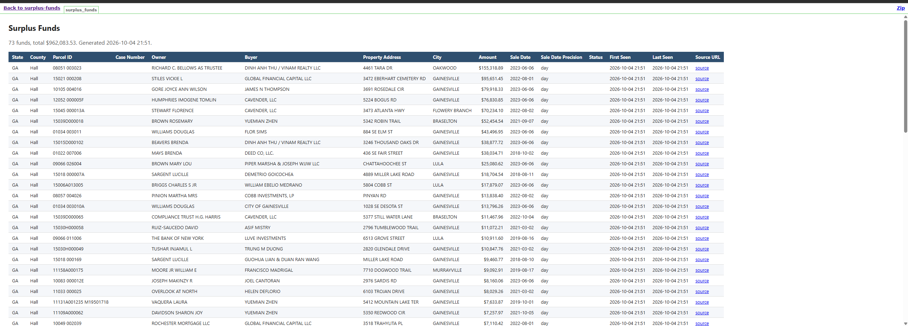
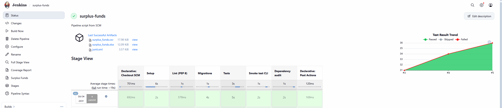
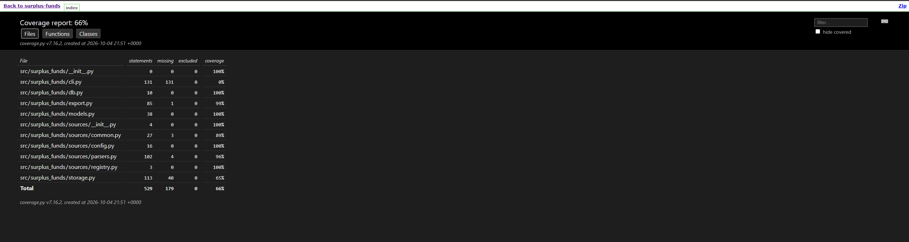

# surplus_funds

Python pipeline that extracts surplus funds (excess proceeds) data from county tax sale reports into a clean, deduplicated database with CSV/Excel export.

Counties publish lists of money left over after tax sales, owed to former property owners, as PDF files or HTML pages, each in its own format. This project downloads those lists, parses them into one common structure, and stores them in PostgreSQL, where they can be searched and exported.

[](docs/images/html-report.png)

## How it works

```
registry.py          download()         parsers.py            storage.py          export.py
SourceConfig  ──►  PDF / HTML bytes  ──►  list of records  ──►  PostgreSQL  ──►  .xlsx / .csv / .html
(URL, format)                            (normalized dicts)    (upsert)
```

1. **Sources**: every county list is described by a `SourceConfig` in `sources/registry.py`: URL, file format and any quirks of that list.
2. **Parsing**: a single universal parser per format (`PdfParser`, `HtmlParser`) finds the header row, maps columns to fields using known header names (`MAPCODE`, `PIN` and `PARCEL ID` all become `parcel_id`), and normalizes amounts and dates.
3. **Storage**: records are upserted by `(source, external_id)`, so importing the same list again updates existing rows instead of duplicating them. Funds that disappear from a newer list are reported as *stale* (most likely paid out).
4. **Export**: stored funds can be exported to Excel, CSV or an HTML page.

## Project structure

```
src/surplus_funds/
├── cli.py              command-line interface (surplus-funds ...)
├── db.py               database engine and session (reads DATABASE_URL)
├── models.py           SQLAlchemy models: Source, SurplusFund
├── storage.py          database operations: CRUD, upsert, search, stale funds
├── export.py           Excel, CSV and HTML export
└── sources/
    ├── registry.py     list of supported sources
    ├── config.py       SourceConfig: description of one source
    ├── parsers.py      universal PDF and HTML table parsers
    └── common.py       download, amount and date parsing helpers
alembic/                database migrations
tests/                  pytest tests
ci/                     Jenkins + PostgreSQL setup for CI
Jenkinsfile             CI pipeline
```

## Requirements

- Python 3.10+
- Docker (for PostgreSQL)

## Setup

```bash
# 1. Virtual environment and dependencies
python -m venv .venv
.venv\Scripts\activate            # Windows
source .venv/bin/activate         # Linux / macOS
pip install -e ".[dev]"

# 2. Database connection
cp .env.example .env              # default values match docker-compose.yml

# 3. Start PostgreSQL and create the tables
docker compose up -d
alembic upgrade head
```

`alembic upgrade head` only needs to be run once on a new database, and again whenever a new migration is added.

## Usage

```bash
surplus-funds sources                                  # list configured sources
surplus-funds scrape ga_hall                           # download, parse and store a list
surplus-funds scrape ga_hall --file list.pdf           # same, from a local file
surplus-funds funds --state GA --min-amount 10000      # search stored funds, largest first
surplus-funds funds --owner smith --limit 50
surplus-funds stale ga_hall                            # funds missing from the latest list
surplus-funds export funds.xlsx                        # export to Excel
surplus-funds export funds.csv --source ga_hall        # export to CSV, with filters
surplus-funds export funds.html                        # export to an HTML page
```

`funds` and `export` accept the same filters: `--source`, `--state`, `--county`, `--owner` (partial, case-insensitive), `--parcel`, `--min-amount`, `--max-amount`. Run `surplus-funds <command> --help` for details.

Example:

```
$ surplus-funds scrape ga_hall
INFO ga_hall: parsed 73 records, skipped 0 rows
ga_hall: 73 records imported, 73 in database, 0 stale
```

## Viewing the database

From the terminal:

```bash
docker compose exec db psql -U postgres -d surplus_funds
```

Or with a GUI client (DBeaver, pgAdmin, PyCharm Database tool):

| Setting  | Value           |
|----------|-----------------|
| Host     | `localhost`     |
| Port     | `5432`          |
| Database | `surplus_funds` |
| User     | `postgres`      |
| Password | `postgres`      |

## Data model

**`sources`**: one row per county list: `key`, `state`, `county`, `agency`, `url`, `file_format`, `last_scraped_at`.

**`surplus_funds`**: one row per list entry:

| Column | Description |
|--------|-------------|
| `external_id` | unique ID within a source, by default `parcel_id\|sale_date` |
| `parcel_id`, `case_number` | identifiers from the list |
| `owner_name`, `buyer_name` | former owner and tax sale buyer |
| `property_address`, `city` | property location |
| `amount` | surplus amount |
| `sale_date`, `sale_date_precision` | sale date; precision is `day` or `month` for lists that only give a month |
| `status` | claim status, if the list has one |
| `raw_data` | the original row as JSON, including columns not mapped to a field |
| `first_seen_at`, `last_seen_at` | when the entry first and last appeared on the list |

## Adding a source

Add a `SourceConfig` to `SOURCE_CONFIGS` in `src/surplus_funds/sources/registry.py`:

```python
SourceConfig(
    key="ga_example",
    state="GA",
    county="Example",
    agency="Tax Commissioner",
    url="https://...",
    file_format="pdf",   # or "html"
),
```

For most lists that is enough, because the parser detects columns from the table header. For lists that don't follow the usual patterns, the optional fields help:

| Field | Use when |
|-------|----------|
| `columns` | the header is not part of the table (e.g. printed above the grid in a PDF) |
| `header_overrides` | a header name is unknown, e.g. `{"AMOUNT DUE OWNER": "amount"}` |
| `id_fields` | `parcel_id` + `sale_date` doesn't uniquely identify a row |
| `table_selector` | an HTML page has several tables, e.g. `"table#funds"` |

If no header row is recognized, parsing fails with a message pointing to these options. New header names used by many counties belong in `FIELD_ALIASES` in `parsers.py`.

## Tests

```bash
pytest                                             # all tests
pytest tests/test_parsers.py -v                    # one file
pytest --cov=surplus_funds --cov-report=html       # with coverage report in htmlcov/
```

- `test_common.py`, `test_parsers.py`, `test_export.py` run without a database. Parser tests use the Hall County PDF stored in the repo, so no network is needed.
- `test_storage.py` needs PostgreSQL running (`docker compose up -d`) with migrations applied. Every test runs in a transaction that is rolled back, so no data is left in the database.

## Code quality

```bash
ruff check .            # lint: PEP 8, pyflakes, import order, bugbear, pyupgrade, security
ruff format .           # format code
pip-audit               # known vulnerabilities in dependencies
```

Rules are configured in `pyproject.toml` under `[tool.ruff]`.

## Continuous integration

The `Jenkinsfile` runs on every build:

| Stage | What it does |
|-------|--------------|
| Setup | creates a virtual environment and installs the project |
| Lint (PEP 8) | `ruff check` and `ruff format --check` |
| Migrations | `alembic downgrade base` + `upgrade head`, verifying migrations in both directions |
| Tests | pytest with JUnit and coverage reports |
| Smoke test CLI | scrapes the Hall County PDF and exports it to Excel, CSV and HTML |
| Dependency audit | `pip-audit`; marks the build unstable on known vulnerabilities |

[](docs/images/jenkins-pipeline.png)

Build results:

- **Test Result**: test results and trend, from `reports/junit.xml`
- **Coverage Report** and **Surplus Funds**: HTML reports, linked in the build's side menu (requires the HTML Publisher plugin)
- **Build Artifacts**: `surplus_funds.xlsx`, `surplus_funds.csv`, `junit.xml`

[](docs/images/coverage-report.png)

### Running Jenkins locally

`ci/` contains a Jenkins image with Python and a PostgreSQL service for the tests:

```bash
cd ci
docker compose up -d --build      # Jenkins on http://localhost:8080
```

Create a *Pipeline* job with *Pipeline script from SCM* pointing to this repository. The pipeline connects to the `db` service from `ci/docker-compose.yml`.
